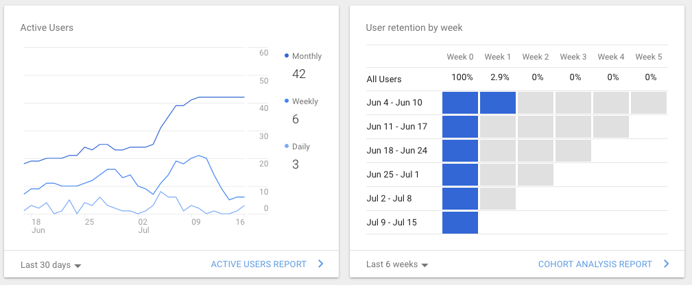

Redesigning a website isn't an easy task. When confronted with an existing website that has an overwhelming amount of content, or just a small amount of poor content, finding a starting point can be a daunting task. No matter how big or small, the first step is conducting a website audit.

A website audit is just the evaluation of a website and its content. We look at what you currently have; the good, the bad and the ugly. Everything is looked at, and we're careful not to let anything sneak under the radar. Now is the time for us and the client to determine what is valuable, and what needs to go.

Rebuilding a website with existing content is a great challenge. Before we can start designing, we need to pull it apart and look at its bones. How are things structured and grouped? How do different types of content interact? Is this site taking advantage of all the channels the company uses?

### Find a sitemap

A current [sitemap](https://www.sitemaps.org/index.html) is a really easy way to see what's happening. Their main purpose is for search engine crawlers to identify all pages on a site, but they're also a valuable source of information about the sites structure. The [sitemap for shelleybassett.com](https://www.shelleybassett.com/sitemap_index.xml) has information on post types, URLs, images, links, creation dates and products.

If we can't find an automatically generated sitemap, we'll take the time to manually follow links on a site, noting down every URL we find. Luckily, we don't have to do this very often as there are a number of tools to create and visualise sitemaps.

### Look at content categories

For a website with a blog or shop, we look at how the posts and products are grouped. Mind-mapping their relationships into categories and sub-categories can help identify when they should be combined, nested or even removed.

Brainstorming different topics for a website

It can also be beneficial to note the number of posts or products in each category. Categories should reflect a business or sites main goals. This information can help refine or eliminate low-performing groups or identify places where more content needs to be produced.

### Check for analytics

If the website is equipped with analytics from a tracing program like Google or Amazon, we take care to delve into them and see what is performing well. It's also important to note if the high traffic URLs are converting into sales or providing other value to the business.

<figure>

</figure>

For businesses without tracking on their websites, we install and monitor it during the redesign process. This data isn't quite as valuable as being able to observe trends over a longer period, but it will provide a baseline to see how our redevelopment is performing.

### Conduct interviews

Having access to the users of the website is an imperative part of a redesign. Whether we have direct access to users (ie, an office intranet), a mailing list or just place a survey on the home page, any feedback will be invaluable to learning how people see themselves interacting with the website. We also ask how they would like to use the site, what works well and what they struggle to do. This provides insight into what should be included on updated pages.

Usability should always be at the forefront of any website design, and there's no better way to get this information than asking the current users.

### Prioritise information accessibility

Usability is key, and accessibility is a huge part of achieving this. Without accessibility, many users will simply find a website unusable. Check the contrast of text and how text-to-speech systems read your site. Checking that images have captions and descriptions is also important, and something a sitemap can help with. [The A11y Project](https://a11yproject.com/) is a great resource to help identify places your site could improve.

Information accessibility also relates to the prose on each page. If something is better explained in a simple graphic, why does a 500 word webpage exist? When we audit a website, we look for places to simplify the message and find the easiest way to convey this to visitors.

### Integrate social channels

Social media is big business and has a huge impact on website traffic. It's valuable to look at how social media users interact with the social platforms (including feed posts, messages and shares), in addition to how those followers translate into website users. Most social media platforms give page administrators access to analytics to help identify these interactions.

It's worth considering these channels as separate user groups, while also considering if they have any overlapping goals. A Twitter account might be incredibly popular for its witty short-form text, but when users need detailed information, how do they find it? Is it a help page on the website, or a message to the Twitter account inbox? Consider ways to link social media and the website so they work together instead of against each other.

There are many steps to auditing a website, and it can be quite a lengthy process. But being thorough in the initial audit will create a clear picture of what we're working with, what the goals are and what is achievable with a redesign.
