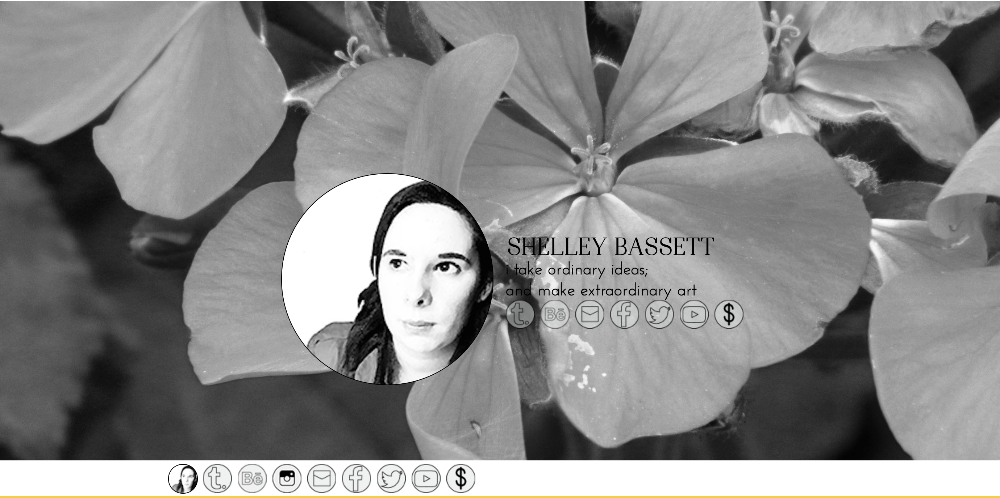
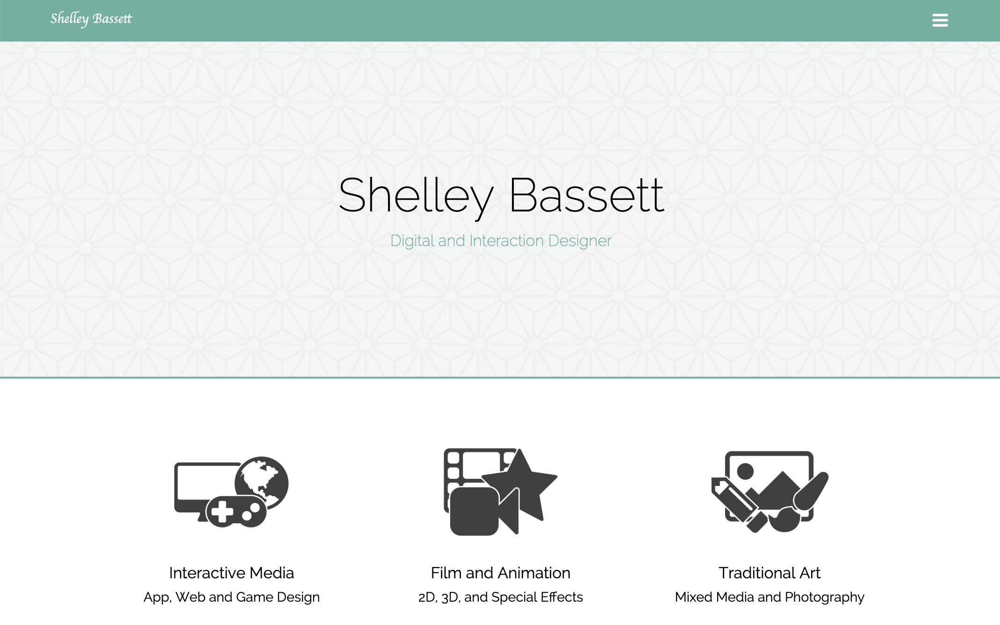
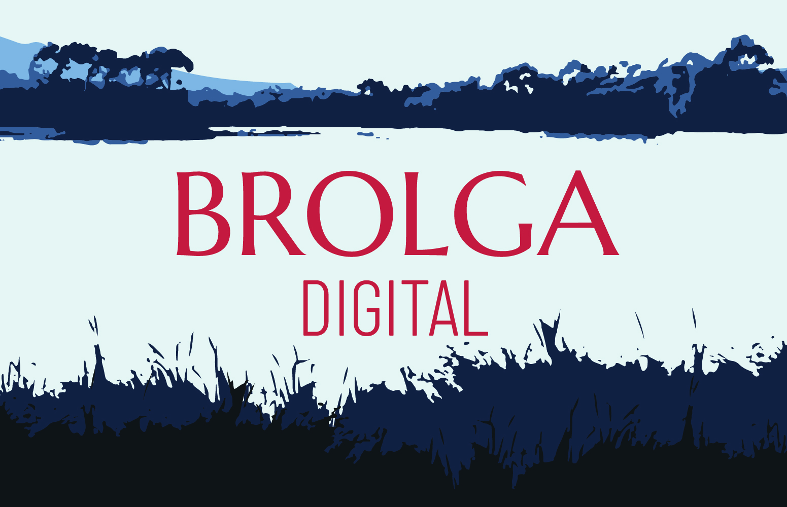

Brolga Digital might seem like a new agency, but did you know we've been in business for 6 years? Initially, we were a one-person operation, a sole-trader operation under [shelleybassett.com](https://www.shelleybassett.com/) and a lot has changed since those days.

Rebranding was a massive undertaking, both for us as a company, and for our customers. The decision was not taken lightly, and a lot of thought and consideration went into choosing a rebrand over simply repurposing the existing _Shelley Bassett_ brand into something new. Philip VanDusen, a branding expert, and has a short video that outlines 4 key reasons to help you decide when to rebrand.

<iframe width="560" height="315" src="https://www.youtube.com/embed/XKfn17vVyRo" title="YouTube video player" frameborder="0" allow="accelerometer; autoplay; clipboard-write; encrypted-media; gyroscope; picture-in-picture" allowfullscreen></iframe>

According to VanDusen, the only reasons that you should consider a rebrand is if you're out of style, don't match your product (or service), are undergoing a transformation, or no longer feel attached to the existing branding. Notice, time is not necessarily a factor in rebranding consideration. Long-standing branding might be a reason to avoid change.

### A case study in brand evolution

Personal branding is its own special challenge as it focuses more on the feeling and emotions of an individual. The _Shelley Bassett_ brand went through several iterations over its lifetime. Very few people would recognise its original version, with black and white images, a bold yellow accent and a serifed typeface.

<figure>

<figcaption>The original branding of Shelley Bassett circa 2015</figcaption>
</figure>

The next design of Shelley Bassett was a total overhaul from the original design. Rather than a hash black and white scheme, the website used a soft grey and complimentary teal. All the typography moved to sans-serif, and clean iconography was introduced.

<figure>

<figcaption>First Rebranding of Shelley Bassett circa 2017</figcaption>
</figure>

The next iteration for _Shelley Bassett_ was a small refresh, introducing a cursive typeface and more imagery. Rather than a rebrand, this was a website redesign to refine the existing palette. It also helped to take into account new features like a blog and shop, with a bold new banner added to the top of the home page.

<figure>

<figcaption>Second and Third rebranding of Shelley Bassett circa 2018 and 2020</figcaption>
</figure>

Finally, the cursive typeface was dropped in favour of a bold, serif font. Shelley still uses this branding as her personal design, however, in 2021 she wanted to move the business in a new direction, restructuring and rebranding entirely as Brolga Digital.

## Should you rebrand, refresh or retain?

So, how to determine whether to rebrand, refresh or retain what you already have? Philip VanDusen's video at the beginning of this post is a good place to start evaluating what you have and where you're going.

The main reasons to change or refresh involve a change in brand direction. If you (or your company) are still working toward the same goals as when the brand identity was created, it's probably best to leave the design alone or use small, subtle tweaks to refine the existing design.

<figure>

<figcaption>The finalised branding for Brolga Digital</figcaption>
</figure>

When you take a major step or change the direction of the business, rebranding can be a great way to differentiate the new from the old. It's a chance for a fresh start, and to create some guides that can tell a single, unified story anywhere someone comes into contact with the company.

Of course, if you hate your branding, there's nothing wrong with scrapping it for something that you actually like. Brolga Digital can help create something you will love for a long time to come.

## Rebranding vs Refining

There are many reasons you might choose to rebrand rather than refine the existing brand. But ultimately, the decision has to be able to answer the question, **will rebranding elevate us to the next level?** If there is any doubt, wait. Brand loyalty and familiarity will carry you further than any fancy redesign.

For any branding changes, be it a tiny tweak, a large refresh or creating something from scratch, Brolga Digital is here to support you through the entire process. Book a consultation today and find out how we can help your business look its best!
